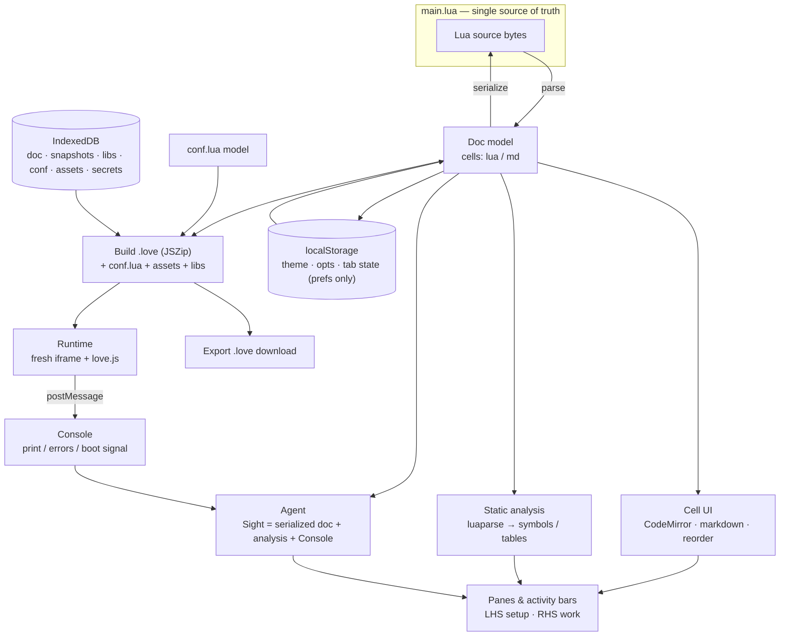

# LoveIDE — design

The reference document for how `index.html` is built and why. Architecture
first, then the process we follow, then a per-subsystem status/divergence ledger.
For the live roadmap see `TODO.md`; for the working agreement see `CLAUDE.md`.

---

## 1. What LoveIDE is

A **single-file, in-browser notebook IDE for authoring LÖVE (Love2D) games**.
Open `index.html`, write Lua in cells, hit Run, and a real LÖVE game boots in an
iframe — no install, no toolchain. Export produces a standard `.love` that
desktop LÖVE runs unchanged.

The defining decision: **`main.lua` is the single source of truth.** The notebook
is a *pure projection* over that one Lua file. Cells are a view; the bytes are the
program. This is enforced by a round-trip invariant:

```
serialize(parse(src)) === src      // byte-for-byte, always
```

Everything else — the analysis panels, the agent's view of the project, the
export — reads from that same serialized source. There is no second copy of the
program's state to keep in sync.

---

## 2. Architecture map



Read it as: **one source feeds many read-only projections**, and only two things
write back to the source — the cell editors and the agent's Hands (when enabled).
Persistence is split by data *nature*: **IndexedDB** holds all project data (doc,
snapshots, libraries, conf, binary assets, encrypted secrets), loaded into memory
once at boot; **localStorage** holds only tiny disposable app prefs (theme, opts,
tab state); the **Cache API** holds regenerable downloads (model weights, love.js).

---

## 3. Subsystems

Mirrors the numbered banner sections in `index.html` (JS sections 0–10).

| # | Subsystem | Role | Key surface |
|---|-----------|------|-------------|
| 0 | Icons | Inline SVG, no icon webfont (the oracle uses one) | `I.*` |
| 1 | Doc model | `main.lua` ↔ cells; the round-trip invariant | `parse`, `serialize`, `normalizeGlue`, `cellBody` |
| 2 | Markdown | marked.js when present, compact built-in fallback | `renderMarkdownHTML` |
| 3 | State + persistence | IndexedDB project data (loaded to memory at boot) + localStorage prefs + Cache API downloads + encrypted secrets | `loadAll`, `idb*`, `idbGet/idbPut`, `loadSecrets`, `LS` |
| 4 | Theme | 6 themes via CSS variables; brand pink/steel | `getTheme`, `applyTheme` |
| 5 | CodeMirror | Lua editor on demand; textarea fallback | `loadCM` |
| 6 | Cell DOM | Render/edit/reorder cells; markdown WYSIWYG | cell render + drag-to-reorder |
| 6b | Activity panels | Outline, Libraries (require()-driven, add-by-URL) | panel renderers |
| 6c | Agent | Local WebLLM (in-browser model manager + streaming chat) and remote API agents (Anthropic/OpenAI/xAI), unified by a group-chat router; real Sight | `detectWebGPU`, `initAgent`, `AGENT_PROVIDERS`, `agentSend`, `remoteChat`, `buildContext` |
| 7 | Runtime | Build `.love`, boot via 2dengine/love.js | `RT`, `playerHTML`, `run`, `buildLoveBlob` |
| 8 | Export | `.love` download | `exportLove` |
| 9 | Self-tests | Doc-model invariants run on demand (Tests button) | `runSelfTests` |
| 10 | Wiring + boot | Tabs, panes, event wiring, startup | `switchTab`, `toggleRightTab`, `layoutRightPane`, `setupPane`, `restorePanes` |

### The runtime, specifically

love.js needs **SharedArrayBuffer**, which needs **cross-origin isolation**
(COOP: same-origin, COEP: require-corp/credentialless). On a static host that's
granted by `coi-serviceworker.js` (gzuidhof) — no server config. The preview is a
**fresh iframe per run** so each boot gets a clean `Module`. The iframe document
is a `blob:`, so player.js's relative engine URLs (`lua/…`, `11.5/love.wasm`)
can't resolve against the blob base — fixed with a `<base href>` pointing at the
love.js CDN root. An iframe→parent `postMessage` bridge carries `print`/errors
back out; that bridge is also the agent's witnessing signal ("booted vs Lua
error").

### Hosting

Live on GitHub Pages from `main`; `coi-serviceworker.js` (above) grants the
cross-origin isolation love.js needs with no server config beyond that. The
app is served directly as `index.html`, so it loads at the site root with no
redirect.

---

## 4. How we work (process)

Adapted from the Ruju project's methodology, right-sized for a single-file app.

### Oracle-as-reference, not spec
`notebook.html` is where the notebook-IDE ideas come from. We read the relevant
part before building a feature it shares, cite what we took, and **record where
we diverge** (§6). LoveIDE is allowed — encouraged — to differ; the oracle is a
compass, not a blueprint.

### The claim ladder
Every claim is graded by the strongest rung its evidence actually reaches:
**Stated → Tested (headless) → Dependency-verified → Browser-verified.** A claim
must never sit a rung above its evidence. Three things are browser-verifiable
*only* in our sandbox and are always flagged as such: **love.js boot**,
**WebLLM/WebGPU**, and **CDN library loads**. (Full statement in `CLAUDE.md`.)

### The increment loop
Build the smallest coherent slice → verify it as far up the ladder as the sandbox
allows → report honestly (what was seen, what couldn't be tested) → update
`TODO.md` and this ledger. The user drives design and picks the next slice.

### Recording intent and divergence
When a decision is non-obvious (why IndexedDB not OPFS; why static analysis not a
runtime debug bridge; why no DuckDB substrate), it gets written down — in a "why"
comment at the code site and, if it shapes the architecture, in §6 here.

---

## 5. How LoveIDE differs from the oracle

The oracle is built around a **DuckDB runtime substrate** shared with a
**reactivity** branch. LoveIDE has neither, and that *simplifies* the foundation:

- **No DB substrate.** `main.lua` is already the single source of truth; Sight is
  the serialized doc + static analysis + Console, with no `_ql_*` / DuckDB layer.
- **No reactivity branch.** `main.lua` is one program, not a reactive cell graph,
  so the oracle's heavy "build the substrate once" step largely collapses for us.
- **Sight is static + Console**, not live runtime values. We parse the source
  (luaparse → Variables/Tables) rather than reading `player.x` at frame 600. A
  live debug bridge is an open option, not a commitment.
- **Witnessing exists but is incomplete.** The intended signal is "the `.love`
  booted and ran without a Lua error," via the Console bridge — vs the oracle's
  typed query/var results. Verified this only half-holds: pre-boot failures do
  flip the app's runtime state, but a Lua error *after* the game is already
  running only reaches the Console text, not the runtime state. Tracked in
  `TODO.md`'s backlog.
- **Checkpoint/revert is nearly free** — a snapshot is `serialize(nb.doc)` (+
  conf); the History machinery already exists. No `exportDBBytes` analog.

---

## 6. Status & divergence ledger

Coarse, per-subsystem. Status is the highest claim rung currently justified.
`B` = browser-verified, `D` = dependency-verified, `T` = tested headless,
`S` = stated.

| Subsystem | Status | Notes / divergence from oracle |
|-----------|:------:|--------------------------------|
| Doc model | **B** | Round-trip invariant covered by self-tests; `-- %%` separators + long-bracket md comments. Our own model — oracle's is SQL/Python-cell oriented. |
| Markdown | **B** | marked.js + built-in fallback. |
| State / persistence | **D** | **Storage tiers by data nature:** IndexedDB = all project data (doc · snapshots · libs · conf · assets · secrets), loaded to memory at boot via `loadAll`, sync reads / async writes; localStorage = tiny prefs only (theme · opts · tab); Cache API = regenerable downloads. kv + AES-GCM secrets round-trip dependency-verified (fake-indexeddb + WebCrypto); end-to-end in-browser still owed. No migration (no data worth keeping). |
| Assets / IndexedDB | **D** | Blobs in IDB (not base64). **Divergence considered:** OPFS rejected — no user-visible files, Chromium-leaning; IDB is enough and portable. |
| Secrets / encrypted | **D** | AES-GCM under a non-extractable device key (key + ciphertext in IDB); ported from the oracle. Storage + minimal API built; **no UI yet**. Verified headless: key non-extractable, ciphertext carries no plaintext. |
| Theme | **B** | 6 themes; brand pink `#EC4899` / steel `#7C8A99`. Heart-`</>` mark shelved. |
| CodeMirror editor | **B** (load **browser-only**) | Lua via legacy mode; textarea fallback if CDN blocked. Fixed a real regression this session: `renderNotebook()` destroys every CM view on structural edits (add/delete/convert cell) but nothing re-attached them — silently dropping the whole notebook to plain textareas until a reload. `renderNotebook()` now re-upgrades at the end of its own render (`upgradeAllEditors()` is cached/cheap past first load), so the explicit boot-time call was redundant and removed. |
| Cell UI / reorder | **B** | Ported drag-to-reorder from the oracle. |
| Static analysis | **D** | luaparse AST → symbols + records-as-grid; validated in node against real luaparse. **Divergence:** oracle's Variables/Tables are *runtime*; ours are *static source*. Same UI intent, different data source. |
| Activity panels | **B** | Outline / Libraries. **API-reference tab removed** (a 42-entry hardcoded cheat-sheet — a curated stub not worth a slot; a real reference would ride a complete love-api dataset + editor autocomplete). |
| Package management | **B** | Adopts the oracle's *no-curated-list* model: the Libraries panel is driven by `require()` auto-detection + manual **add-by-URL**. **Divergence (design-sanctioned, Lua≠Python):** the oracle resolves packages by *name* via micropip/PyPI; Lua has no in-browser resolver (no LuaRocks), so LoveIDE resolves by *URL* — single-file pure-Lua only, vendored into the `.love`. |
| Runtime (love.js) | **browser-only** | Boots when served cross-origin-isolated; `<base href>` fix landed and user-confirmed once ("It works!"). Cross-browser sweep still owed. Not exercisable in sandbox (CDN egress blocked). |
| Console / RHS panels | **B** | Canvas, Variables, Tables, and Console are independently-toggleable RHS panels, not mutually-exclusive tabs — any combination can be open at once, stacking top-to-bottom in activity-bar order (Canvas first, Console last) with draggable dividers between open panels; 0 open collapses the pane. Console has its own empty state plus Clear/Copy actions. Also the agent's Sight/witness channel, via `recentConsole()`. **Divergence from the earlier plan:** the oracle-inspired idea of promoting Console to a single peer tab was superseded during design — a plain tab would have fought visibility with Canvas/Variables/Tables, so the toggle/stack model replaced it. |
| Export `.love` | **D** | JSZip build incl. main.lua + conf + assets + libs. Download path browser-only. |
| conf.lua | **B** | `generateConfLua`, defaults, Game-settings panel. |
| Agent — local | **browser-only** | WebLLM manager (Qwen2.5-Coder 1.5B/3B/7B), install/activate, VRAM gate, streaming chat. Untestable in sandbox (no GPU). |
| Agent — Sight | **T** (branching) / **browser-only** (e2e) | `buildContext()`: full current `main.lua` + conf + recent Console each turn, luaDigest fallback when over budget for local's small window (`AGENT_SIGHT_BUDGET`); remote calls pass no budget (full source, full console, no digest). `context_window_size` raised to 8192 at local load. History is no longer capped for either backend — a deliberate simplification, see `TODO.md`'s Open Question 4 for the local-overflow risk it trades in. Full-vs-digest branching tested headless; window override is dependency-reasoned, not run. |
| Agent — remote chat | **B** (Anthropic) / **T** (routing, other providers) | `agentSend()` routes to whichever single agent — local WebLLM or one remote provider — is currently active; `agent.messages` carries a `from` field so the transcript still shows attribution across turns where you switched agents. Local and remote are mutually exclusive by construction: `agentToggleVram(true)` clears `loveide:activeRemoteAgent`, and a remote row's activate handler unloads Qwen from VRAM first (`agentToggleVram(false)` — disk cache untouched, just not the active chat agent). **Divergence from the session's own earlier design:** a 2-agent pipeline (local relays the raw message + full Sight to remote, marked by a `sys`-styled transcript line) was built and headless-tested, then removed once live testing showed it cost real VRAM and code complexity for zero functional difference from remote-only — the local leg was always a no-op passthrough. `remoteChat()` calls Anthropic's `/v1/messages` and OpenAI/xAI's `/v1/chat/completions` directly from the browser, non-streaming. User-confirmed live in-browser against Claude (real reply rendered, including a code block). Routing (single-agent branch selection, error-body surfacing, cancel/race-safety below) tested headless against the real extracted functions. **Removed:** the pre-existing "Insert as cell" button (regex-scraped a ```lua block from a reply, dumped it verbatim as one new cell at the bottom). Live testing showed a capable remote model reliably writes whole-file replacements, and the button had no way to know that — it silently duplicated existing functions instead of replacing them, and (via `renderNotebook()`'s destroy-without-reattach bug above) transiently broke syntax highlighting. Deliberately not replaced with a smarter version yet: the standing principle is that Sight-only mode shouldn't ship *any* UI affordance that mimics hands-on doc-mutation, even a manually-clicked one — real Hands is designed to land behind Checkpoint/revert first (see `TODO.md`). A copy-to-clipboard alternative is under discussion, not yet built. **Cancel/interrupt:** Escape (input focused) or a Stop button (swapped in for Send while generating) is "pulled back" — the whole turn is dropped from `agent.messages` and your text restored to the input, not left sitting in a transcript that gets fully resent every later turn. Local uses `MLCEngine.interruptGenerate()` (dependency-verified against the real `@mlc-ai/web-llm` package); remote uses a per-turn `AbortController`. Every in-flight generation function checks its OWN turn's cancellation token, not the shared `agent.cancel` global (which may already belong to a newer turn) — headless-tested including the rapid cancel-then-resend race. |
| Agent — Hands/Modes | **S** | Designed in `TODO.md`; not built. |

When a row's rung changes or a new divergence is decided, update it here in the
same commit as the code change.
